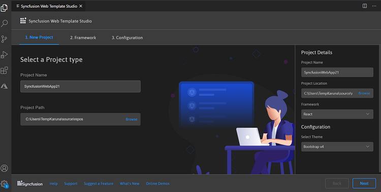
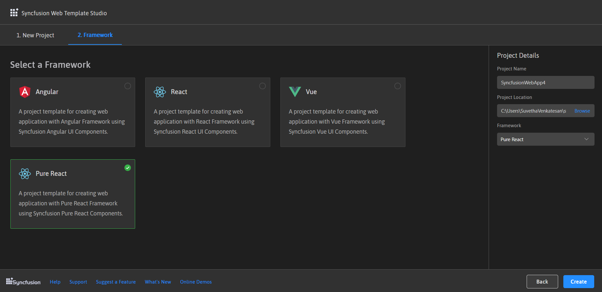
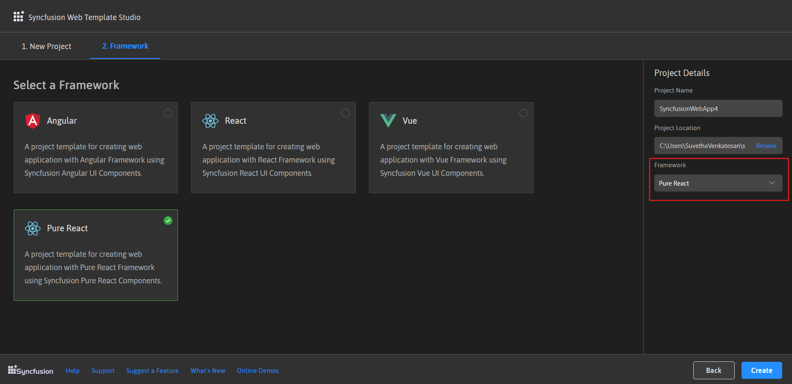
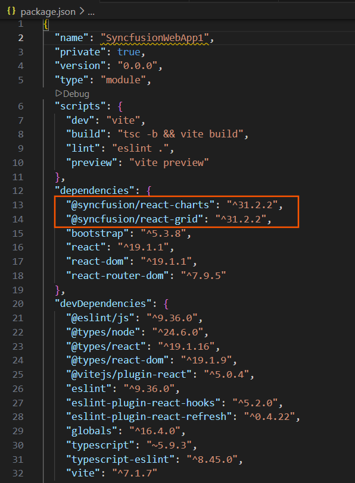
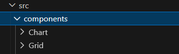
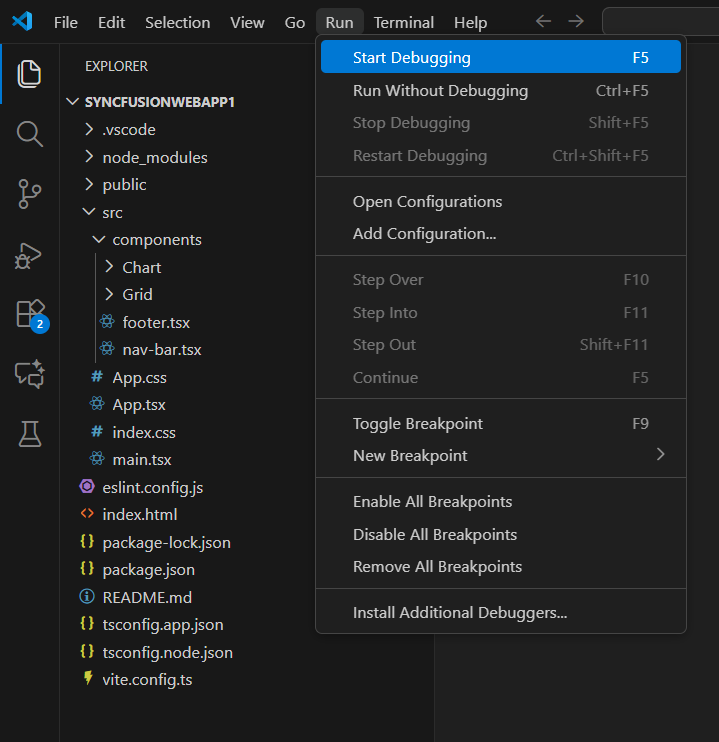
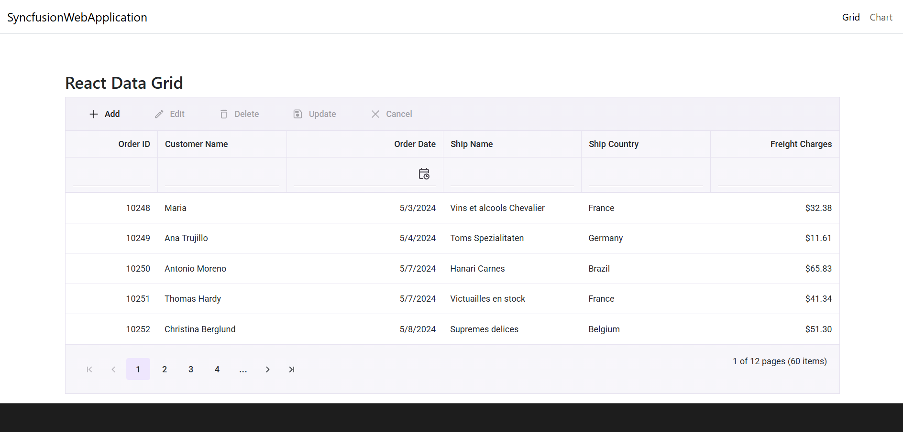

# Visual Studio Code Extensions 

## Create project

Syncfusion&reg; provides **project templates** for **Visual Studio Code** to streamline the creation of Syncfusion&reg; Pure React applications. These templates automatically configure your project with the required Syncfusion&reg; NPM packages, component render code for Grid and Chart components, and appropriate styling to accelerate development with Syncfusion&reg; components.

   > The Syncfusion&reg; Visual Studio Code project template provides support for Web project templates from v18.3.0.47.

The steps below help you to create **Syncfusion&reg; Web Applications** through the **Visual Studio Code:**

1. In Visual Studio Code, open the command palette by pressing **Ctrl+Shift+P**. In the palette, search for **Syncfusion&reg;** to see the available templates.

    

2. Select **Syncfusion&reg; Web Template Studio: Launch** and then press enter, Template Studio wizard for configuring the Syncfusion&reg; Web app will appear. Provide the require Project Name and Path to create the new Syncfusion&reg; Web application along with any one of the Framework (React, Pure React, Angular, and Vue).

    

3. Click either **Next** or **Framework** tab, and the Framework types will be appears. Choose any one of the Framework:
   * React
   * Pure React
   * Angular
   * Vue

    

    If you choose the Pure React framework, it will appear in the **Project Details section**, and you can then create the Pure React application.

     

4. The created Syncfusion&reg; Web App is configured with the Syncfusion&reg; NPM packages, styles, and the component render code for the Syncfusion&reg; component added.

    

    

    

## Run the application

1. Click on **F5** or navigate to **Run>Start debugging**

    

2. After the compilation process completed, open the localhost link in browser to view the output.

    

## Add Syncfusion&reg; component to the application

We have showcased the Chart and Grid component in Syncfusion&reg; web application. If you want to create your application with other Syncfusion&reg; components, you need to install the required component package and then you can add it in your application. To know about npm package installation, refer to the [installation](https://ej2.syncfusion.com/react/documentation/installation/npm-package) section.

## Upgrading the npm packages

While creating the new Syncfusion&reg; web app, it install the npm packages with latest version. If you want to use your existing project in future, you can update the npm packages without uninstalling it. Refer to the [update npm packages](https://ej2.syncfusion.com/react/documentation/common/how-to/update-npm-package/) section for upgrading the package.