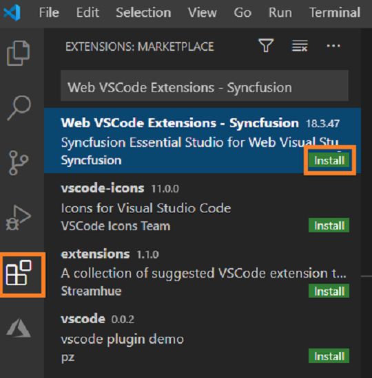
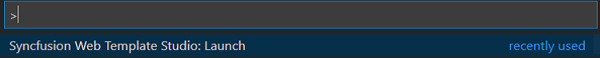

# Download and Installation

Syncfusion&reg; publishes its Visual Studio Code extension in the [Visual Studio Code marketplace](https://marketplace.visualstudio.com/items?itemName=SyncfusionInc.Web-VSCode-Extensions). You can install the extension directly within Visual Studio Code or download it from the marketplace and then install it.

## Prerequisites

Before installing the Syncfusion&reg; Web extension, ensure you have the following software installed:

* [Visual Studio Code](https://code.visualstudio.com/download)

 > The minimum version of the Visual Studio Code is 1.38.0 to use the Syncfusion&reg; Web Extension.

* [C# Extension](https://marketplace.visualstudio.com/items?itemName=ms-vscode.csharp)

* [Node.js](https://nodejs.org/en/download/)

## Install through Visual Studio Code extensions

The following steps explain how to install the Syncfusion&reg; Web extensions from Visual Studio Code Extensions.

1. Open Visual Studio Code.

2. Go to **View > Extensions**, and open Manage Extensions.

3. Type **“Syncfusion&reg; Web** in the search box.

     

4. Click the Install button on the **"Web VSCode Extensions - Syncfusion&reg;"** extension.

5. After the installation, reload the Visual Studio Code using the **Reload Required** in Visual Studio Code palette.

6. Now, use the Syncfusion&reg; Web extensions from the Visual Studio Code palette.

     

## Install from the Visual Studio Code Marketplace

The following steps explain how to download Syncfusion&reg; Web applications from the Visual Studio Code Marketplace and install them.

1. Open the [Syncfusion&reg; Web Extension](https://marketplace.visualstudio.com/items?itemName=SyncfusionInc.Web-VSCode-Extensions)

2. Click Install from Visual Studio Code Marketplace. The browser opens the popup with the information like **“Open Visual Studio Code”**. Click Open Visual Studio Code, then [Syncfusion&reg; Web Extension](https://marketplace.visualstudio.com/items?itemName=SyncfusionInc.Angular-VSCode-Extensions) will open in Visual Studio Code.

3. Click the Install button in the **"Web VSCode Extensions - Syncfusion&reg;"** extension.

4. After the installation, reload the Visual Studio Code using the Reload Required in Visual Studio Code palette.

5. Now, use the Syncfusion&reg; Web extensions from the Visual Studio Code palette.

     